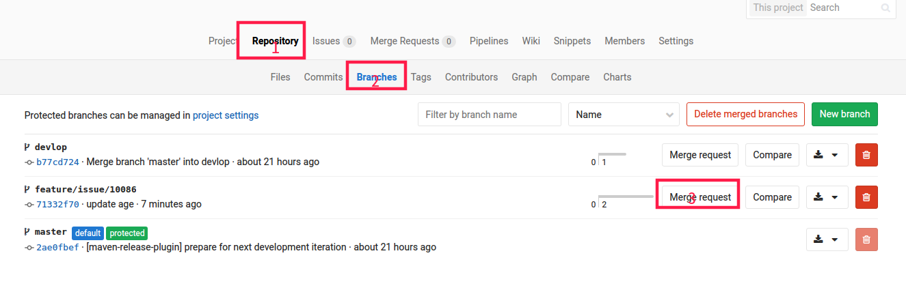
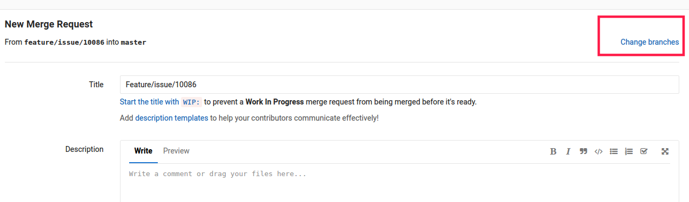
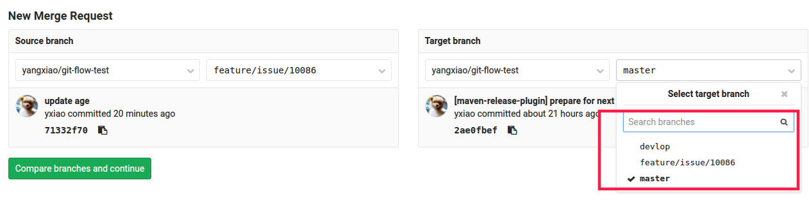
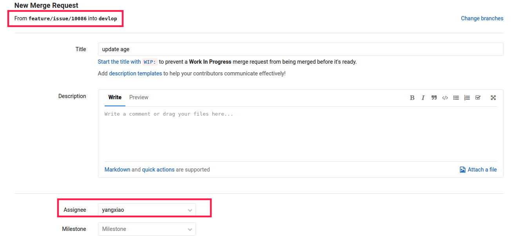
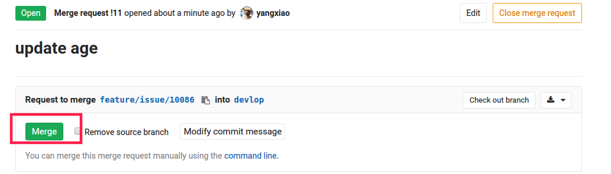

# 操作示例

以[git-flow-test](https://git.wlcxbj.com/yangxiao/git-flow-test)项目为例，操作演示完整git flow工作流程

## 一、开发阶段
开发阶段，最主要的分支是`devlop`，`develop`是保存当前最新开发成果的分支，它承担的责任就是功能开发。当代码已经足够稳定时，就可以将所有的开发成果，发布到一个`release`分支，进行QA测试。允许有代码提交，建议只使用`Merge Request`和`Merge`

`feature/issue/{issueNumber}`是一个辅助分支，用于并行开发新功能。

### 1.新建feature

在项目管理软件（如禅道）中建立单个任务，基于devlop建立分支`feature/issue/{issueNumber}`，变量 `{issueNumber}` 对应该项目在禅道上的一个 `issue number`，功能完成后Merge到develop分支

假设在禅道中建立一个开发任务，任务号为`10086`

	git checkout -b feature/issue/10086

新建`feature/issue/10086`分支，并切换至该分支

### 2.commit
完成<code>issue number</code>对应的开发功能后，提交代码

	git add .
	git commit -m "update age"

### 3.push

	git push --set-upstream origin feature/issue/10086

`--set-upstream`用于绑定远程和本地分支，之后的操作命令，不需要在命令行指定远程的分支。

本次提交commit记录：[71332f7022af8ec82d4d2c5d05ddd2e665d45b6c](https://git.wlcxbj.com/yangxiao/git-flow-test/commit/71332f7022af8ec82d4d2c5d05ddd2e665d45b6c)

### 4.合并到devlop
第一种做法可以在本地仓库合并到devlop并push到gitlab

第二种做法可以在gitlab上，选择`feature/issue/10086`进行`Merge Request`

进入下一个页面后，默认的是向`master`分支发`Merge Request`，这里进行修改，占击右上角**Change branches**

`Target branch`我们选择`devlop`

这里可以看到，已经修改成`From feature/issue/10086 into devlop`，然后将此任务指给自己，提交`Merge Request`

`Merge Request`已经建立，并指给自己，打开`Merge Request`后点击`Merge`进行merge

然后在本地操作，切换到`devlop`分支，并pull代码

	git checkout devlop
	git pull

## 二、QA阶段
开发任务全部完成，开始进行QA测试

### 1.发布release分支
我们会基于`devlop`建立分支`release/version/{verisonNumber}`，变量 `{versionNumber}` 对应该项目接下来上线的版本号，允许有代码提交，建议只使用`Merge Request`或`Merge`

假设这次项目开发的版本号为`1.2.6`

	git checkout -b release/version/1.2.6
	git push --set-upstream origin release/version/1.2.6

此时，应该将`release/version/1.2.6`代码发布到QA环境，进行测试。

### 2.Bug fix
bugfix分支基于release分支创建，用于修改单个bug，应该不超过一天

当测试在禅道上，提交了一个bug，假设此bug的`issue number`为`9527`

	git checkout -b bugfix/issue/9527

修改bug后，提交

	git add .
	git commit -m "fix bug #9527"

### 3.合并到release

将`bugfix/issue/9527`合并至`release/version/1.2.6`，操作和开发阶段时将feature合并devlop一样，两种方法。如果使用`Merge Request`，`Target branch`一定要改为`release/version/1.2.6`

重新发布`release`代码至测试环境，然后测试人员`review`此bug，直到此bug解决为止。

## 三、上线

`release/version/1.2.6`分支测试通过后，可以上线至`master`分支

我们在`gitlab`上提交`Merge Request`即可，此时，`Source branch`为`release/version/1.2.6`，`Target branch`为`master`，将此MR指给项目负责人

项目负责人所要做的有：

- 打开收到的`Merge Request`，检查无误后，点击`Merge`将代码合并到`master`
- 检查master代码，如果maven项目，需要修改版本号
- 给master代码打tag，如果是maven项目，还需将tag代码发布到maven私服
- tag代码发布至线上环境

