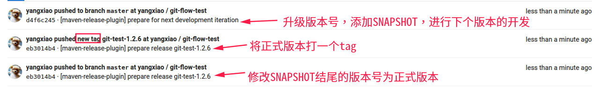

# Maven项目Release示例

开发阶段，项目版本一定是以`SNAPSHOT`结尾的，`SNAPSHOT`是快照的意思，项目到一个阶段后，就需要发布一个正式的版本（release版本）。一次正式的发布需要这样一些工作：

- 在`master`中，更新`pom`版本从`1.0-SNAPSHOT`到`1.0`
- 对`1.0`打一个`git tag`
- 针对`tag`进行`mvn deploy`，发布正式版本
- 更新`master`从1.0到`1.1-SNAPSHOT`

可以看出，项目版本的变化是，从`1.0-SNAPSHOT`到`1.0`再到`1.1-SNAPSHOT`

##一、Maven项目配置

添加`scm`标签
```xml
<scm>
	<connection>scm:git:ssh://git@git.wlcxbj.com:2289/yangxiao/git-flow-test.git</connection>
	<developerConnection>scm:git:ssh://git@git.wlcxbj.com:2289/yangxiao/git-flow-test.git</developerConnection>
	<tag>HEAD</tag>
</scm>

```
添加插件配置,忽略的版本号，继承于父项目(spring boot parent)

```xml
<plugin>
	<groupId>org.apache.maven.plugins</groupId>
	<artifactId>maven-release-plugin</artifactId>
	<version>2.5.3</version>
	<configuration>
		<autoVersionSubmodules>true</autoVersionSubmodules>
	</configuration>
</plugin>
<plugin>
	<groupId>org.apache.maven.plugins</groupId>
	<artifactId>maven-deploy-plugin</artifactId>
</plugin>
<plugin>
	<groupId>org.apache.maven.plugins</groupId>
	<artifactId>maven-javadoc-plugin</artifactId>
	<configuration>
		<encoding>UTF-8</encoding>
		<charset>UTF-8</charset>
		<additionalparam>-Xdoclint:none</additionalparam>
	</configuration>
</plugin>
```
`maven`私服配置

```xml
<distributionManagement>
	<repository>
		<id>wlcx-nexus-repo</id>
		<url>http://maven.wlcxbj.com/nexus/content/repositories/releases/</url>
	</repository>
	<snapshotRepository>
		<id>wlcx-nexus-snapshots-repo</id>
		<url>http://maven.wlcxbj.com/nexus/content/repositories/snapshots/</url>
	</snapshotRepository>
</distributionManagement>
```
`maven`本地`settings.xml`需要配置`maven`私服的帐号，如
```xml
<server>
	<id>wlcx-nexus-repo</id>
	<username>用户名</username>
	<password>密码</password>
</server>
<server>
	<id>wlcx-nexus-snapshots-repo</id>
	<username>用户名</username>
	<password>密码</password>
</server>

```

## 二、Maven-release插件演示

### 1.检出代码

	git checkout master
	git pull
### 2.mvn release:prepare
假设当前版本号为`1.2.6-SNAPSHOT`

	mvn release:prepare -Darguments="-Dmaven.test.skip=true"

执行过程中，你会遇到这样的提示：

>What is the release version for "git-test"? (com.wlcx.test:git-test) 1.2.6: :

“你想发布的版本号是什么？默认是`1.2.6`。” 我要的就是`1.2.6`，直接回车。

>What is SCM release tag or label for "git-test"? (com.wlcx.test:git-test) git-test-1.2.6: :

“发布的tag标签名称是什么？默认为`git-test-1.2.6`。”我还是要默认值，直接回车。

>What is the new development version for "git-test"? (com.wlcx.test:git-test) 1.2.7-SNAPSHOT: :

“新的开发版本是什么？默认为`1.2.7-SNAPSHOT`。”release插件会自动帮我更新版本到 `1.2.7-SNAPSHOT`，很好，直接回车。

然后屏幕刷阿刷，`maven`在`build`我们的项目，并进行了一些git操作，你可以仔细查看下日志。打开`gitlab`，你可以看到多了三条信息。



### 3.mvn release:perform

	mvn release:perform -Darguments="-Dmaven.javadoc.skip=true -Dmaven.test.skip=true"


`maven-release-plugin` 会自动帮我们签出刚才打的tag，然后打包，分发到远程Maven仓库中


至此，整个版本的升级，打标签，发布等工作全部完成。我们可以在远程Maven仓库中看到正式发布的`1.2.6`版本。仓库地址：http://maven.wlcxbj.com/nexus/content/repositories/releases/


版本发布完成之后，也别忘了，将代码合并至devlop中

	git checkout devlop
	git merge master
	git push

